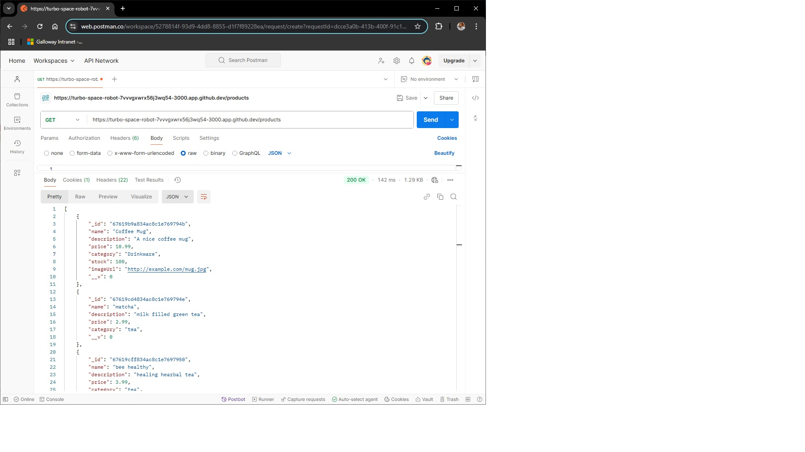

# Coffee Shop Backend

A simple backend server for managing products using Express and MongoDB.

## Features
- RESTful API endpoints
- Add products with fields like name, description, price, category, stock, and imageUrl.
- MongoDB for data persistence.

## Setup Instructions

1. **Clone the Repository**

   `git clone https://github.com/yourusername/coffee-shop-backend2.git`

   `cd coffee-shop-backend2`

2. **Install Dependencies**

   `npm install`

3. **Setup Environment Variables**

   Create a `.env` file in the root directory and add your MongoDB URI like so:

4. **Start the Server**

`npm start`

The server will run at `http://localhost:3000`.

## API Endpoint Screenshots

### POST /products: Create a new product

### GET /products: Get all products

### GET /products/:id: Get a single product by ID

### PUT /products/:id: Update a product by ID

### DELETE /products/:id: Delete a product by ID

## AUTH Screenshots

### POST /auth/register: Register a new user

### POST /auth/login: Login a user

### GET /protectedroute: Access a protected route (requires JWT authentication)

